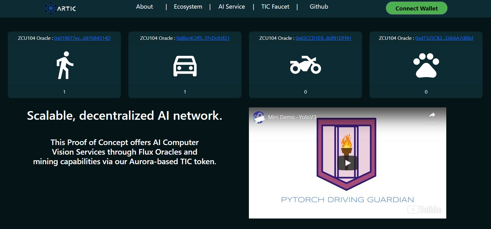
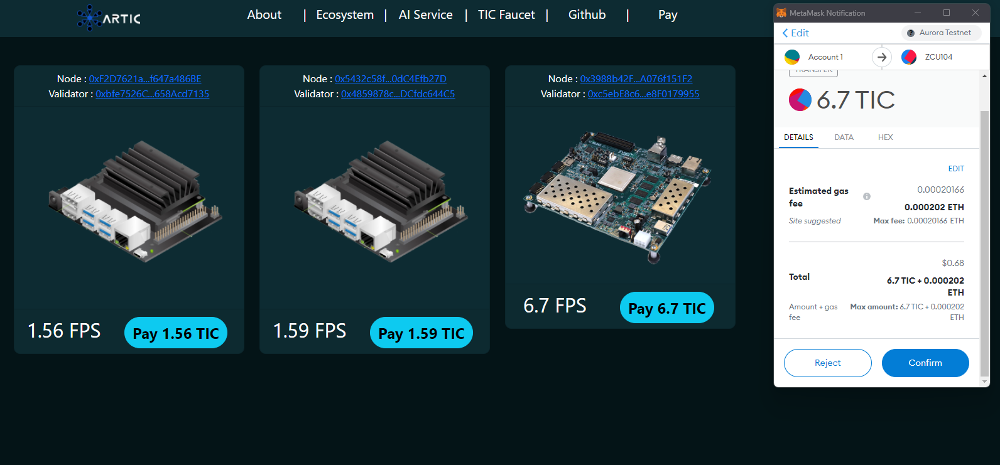

  

# Artic
DeAI: Decentralized AI infrastructure. 

Artic provides Decentralized Computer Vision services where you can mine through Edge Devices, employing Flux oracles and the Near-Aurora Blockchain.

 Hi, if you are a judge and want to review the AI model running in GoogleColab here are the notebooks.

[YOLOv3](https://colab.research.google.com/github/altaga/Artic/blob/main/Minner/Python%20AI/YoloV3.ipynb)

## To test the product follow this link:

 https://www.articprotocol.online
 
 If you need more help and to check our codebase go to [Appendix I](#appendix-I)
 
 #### All the Smart Contracts codebase (Near-Aurora and Flux) is at: https://github.com/altaga/Artic/tree/main/Contracts
 
## Introduction and Problem

Computer vision is a field of artificial intelligence that trains computers to interpret and understand the visual world. Using digital images from cameras and videos and deep learning models, machines can accurately identify and classify objects and then react to what they “see.”

In fact, as the most mature field in modern AI, it is permeating every sector of the economy. The opportunities that automating visual capabilities bring endless market opportunities across every sector. 

The global computer vision market size was valued at $9.45 billion in 2020, and is projected to reach $41.11 billion by 2030, registering a CAGR of 16.0% from 2020 to 2030.

Most AI and cloud providers nowadays such as Google cloud, Amazon AWS, Azure and many others offer AI, Machine learning and also to some degree Computer Vision services in their repertoire. One of the recent moves of this industry has been into the adoption of Edge Computing as the demand for computer power increases. Edge computing is computing that takes place at or near the physical location of either the user or the source of the data. By placing computing services closer to these locations, users benefit from faster, more reliable services while companies benefit from the flexibility of hybrid cloud computing. Edge computing is one way that a company can use and distribute a common pool of resources across a large number of locations.

Edge computing is in use today across many industries, including telecommunications, manufacturing, transportation, utilities, and many others. The reasons people implement edge computing are as diverse as the organizations they support.

The key areas that will be forever impacted by AI+Edge computing will be 5G, IoT and Self driving and vehicle communications. 

The main issue with this field is that it is primordially in the hands of certain Big tech incumbents thus it is highly centralized.

We think Near through Aurora and Flux can provide us with the tools to launch a highly decentralized web3 service for Computer Vision with incentives for those who would run our “nodes”.

## Solution

So our plan is to create what we will call Decentralized AI infrastructure. By providing Decentralized Computer Vision services where you can mine through Edge Devices, employing Flux oracles and the Near-Aurora Blockchain. Thus, making it a true web3 project.

Part of our decision to employ AI Edge devices is the very recent partnership of Flux with Nvidia to run nodes and other applications on Nvidia boards and devices such as the Jetson Nano. And also one of the most important hardware distributors nowadays which is seeed has also joined this play.

We happen to have a lot of history with both companies and we also have a Jetson Nano at hand AND the Machine Learning skills to develop such an idea.

 

## How it's Built

This is the main schematic of our solution:

So the development has been done in three parts:

### 1. The Near-Aurora blockchain incentive infrastructure and service base:
The project will be named Artic so we will create a token called TIC to give monetary incentives to people who run our Jetson Nano based nodes. This will include the landing page, UI, Smart Contracts that will be linked to a Flux oracle and so forth. For now we are running a number of Jetson Nano Devices, each of them send to four different Smart contracts the results of their computations using Flux oracles and then this is fed into an Aurora Smart contract and later the main UI.

Here is the landing page:

The AI service (Notice the four computations that come from four contracts each):

And a temporal Faucet for you to test the system:

You can pay for AI services in this other screen through Metamask:

You can see all the Aurora-based smart contracts that run on this layer here, including the ones that come from Flux oracles: https://github.com/altaga/Artic/tree/main/Contracts

Now, while we are speaking about flux...

### 2. Flux Infrastructure.

This infrastructure runs then from the Edge device all the way to Flux oracles and ends with the Aurora Smart contract.

On our AI service page you can see one of our oracles feeding their contract in real time, you can check all of this directly in the Aurora Explorer.

In this case this oracle obtains its data from the edge processing of images in a jetson nano through the YoloV3 model, this is a practical example of how the oracle could be fed with an AI model.

### 3. Edge Device running Machine Learning CV services.

We are using 2 Jetson Nanos and 1 ZCU104 to run these services and for this PoC they are running a YoloV3 image classification algorithm that has several use cases including automotive applications.

Jetson Demo:

You can see an application of that in this video:

Video: Click on the image

ZCU104 Demo:

You can see an application of that in this video:

Video: Click on the image

## What's Next:

We think this Proof of concept is a true web3 development that has backing in all the market research provided and the fact that these kind of cloud based services will grow for the forseeable future. Nevertheless we are providing for now just one service with one use case and that is one aspect that we want to improve and also we need to reach users and test if they will use a service such as this one. In that same sense we also need to reach miners or node providers to see if we can reach certain market and truly decentralize these services. For now everything runs smoothly from the Jetson Nanos to Flux oracles and the to Aurora and thus Near. We have seen the huge growth of projects of this kind in examples such as the Helium Network, Arweave and even Flux itself, as the incentives give the network the push from the abyss of the first consumers and infrastructure to reach new hights and be truly decentralized, this is just another exmple on how to weaponize web3 through a very requested service. For now we will keep on working and perhaps in a future Flux can offer through us these kind of AI services anchored on Aurora and the Near protocol. 

## References

https://www.sas.com/en_us/insights/analytics/computer-vision.html
https://www.precisionag.com/digital-farming/how-computer-vision-is-fast-becoming-the-backbone-of-next-generation-agronomy/
https://www.alliedmarketresearch.com/computer-vision-market-A12701#:~:text=The%20global%20computer%20vision%20market,around%20it%20just%20like%20humans.

 # Appendix I

Artic is a decentralized platform of Oracles based on AI processing at the Edge.

 ## System's Architecture:

 # WebApp UI:

 ## Landing:

As part of the solution we have our home page, where we explain the project and you can review all our documentation.

 ## AI Service:

On our AI service page you can see one of our oracles feeding their contract in real time, you can check all of this directly in the Aurora Explorer.

### Jetson Nano:

Jetson Nano oracle obtains its data from the edge processing of images in a jetson nano through the YOLOv3 model, this is a practical example of how the oracle could be fed with an AI model.

### ZCU104:

ZCU104 oracle obtains its data from the edge processing of images in a ZCU104 with DPU module through the YOLOv3 inference model, this is a practical example of how the oracle could be fed with an AI model.

https://www.articprotocol.online/demo

## TIC Faucet:

As part of our system, we created an ERC20 token in order to provide an incentive for miners to join our AI platform.

If you want to get some test token please go to the Facuet page and follow the instructions mentioned there.

## Payment:

As part of the rewards that we want to give to the miners for providing information to the oracles. As providers we can make a direct payment of our token from the payment tab, if you want to try sending some TIC to one of them first check the [Faucet](#tic-faucet)

The pay buttons are functional, try sending some TIC to some of the miners for their good work.

By clicking on the addresses of the miners you can see their addresses and see the interactions with the nodes directly.

# Appendix II:

 Nodes and Oracles information:

| Device     | Address                                    | Kind                  |
| ---------- | ------------------------------------------ | --------------------- | 
| Jetson 1   | [0x0d608FBa0b1F7CF8015e052aDb5dC7D9fFAa753d](https://explorer.testnet.aurora.dev/address/0x0d608FBa0b1F7CF8015e052aDb5dC7D9fFAa753d/transactions) | Human Detection       |
| Jetson 1   | [0xe3C99a49eD7E6c14c03650394F5DB1A35A2177b5](https://explorer.testnet.aurora.dev/address/0xe3C99a49eD7E6c14c03650394F5DB1A35A2177b5/transactions) | Cars Detection        |
| Jetson 1   | [0x8510eCC6a9974B992337553D62eF5B32c93D841c](https://explorer.testnet.aurora.dev/address/0x8510eCC6a9974B992337553D62eF5B32c93D841c/transactions) | Motorcycles Detection |
| Jetson 1   | [0x039E0a3fa88288a3305c0053BbC9e2A114d217db](https://explorer.testnet.aurora.dev/address/0x039E0a3fa88288a3305c0053BbC9e2A114d217db/transactions) | Dogs Detection        |
| Jetson 1   | [0xF2D7621a6CE7fa4171C4a93eb41035f647a486BE](https://explorer.testnet.aurora.dev/address/0xF2D7621a6CE7fa4171C4a93eb41035f647a486BE/transactions) | FPS Register          |
| Jetson 2   | [0x49e745675a6337F6483270466df148501cf7D1DB](https://explorer.testnet.aurora.dev/address/0x49e745675a6337F6483270466df148501cf7D1DB/transactions) | Human Detection       |
| Jetson 2   | [0xec7702B9d8Ff5dCf3cE4f1Fd2f4E93495aAe631c](https://explorer.testnet.aurora.dev/address/0xec7702B9d8Ff5dCf3cE4f1Fd2f4E93495aAe631c/transactions) | Cars Detection        |
| Jetson 2   | [0x9F30E32223F72F3c9e509FAEC4C345eCF1fDa2e5](https://explorer.testnet.aurora.dev/address/0x9F30E32223F72F3c9e509FAEC4C345eCF1fDa2e5/transactions) | Motorcycles Detection |
| Jetson 2   | [0x9d939199329A1deE84d1b29dEC247B0b89b88F32](https://explorer.testnet.aurora.dev/address/0x9d939199329A1deE84d1b29dEC247B0b89b88F32/transactions) | Dogs Detection        |
| Jetson 2   | [0x5432c58ffF160417E757A78Af9a4360dC4Efb27D](https://explorer.testnet.aurora.dev/address/0x5432c58ffF160417E757A78Af9a4360dC4Efb27D/transactions) | FPS Register          |
| ZCU104     | [0x019677ec8d776c596124F68753E016687684514D](https://explorer.testnet.aurora.dev/address/0x019677ec8d776c596124F68753E016687684514D/transactions) | Human Detection       |
| ZCU104     | [0xBbc4C0f5C7f6a15e64B112b496592bf7cDc93f21](https://explorer.testnet.aurora.dev/address/0xBbc4C0f5C7f6a15e64B112b496592bf7cDc93f21/transactions) | Cars Detection        |
| ZCU104     | [0x65CCD1E9f0d2b4Ddd57c4DB6FC857d8df81DFf41](https://explorer.testnet.aurora.dev/address/0x65CCD1E9f0d2b4Ddd57c4DB6FC857d8df81DFf41/transactions) | Motorcycles Detection |
| ZCU104     | [0xd7325CB258669F67723468c01ef24cE6b6A7d88d](https://explorer.testnet.aurora.dev/address/0xd7325CB258669F67723468c01ef24cE6b6A7d88d/transactions) | Dogs Detection        |
| ZCU104     | [0x3988b42F7205893c7551b9a9984A44A076f151F2](https://explorer.testnet.aurora.dev/address/0x3988b42F7205893c7551b9a9984A44A076f151F2/transactions) | FPS Register          |
| Aggregator | [0xcDff32Cf5616Cb0F8001AA7e57AD103f0dc85dA2](https://explorer.testnet.aurora.dev/address/0xcDff32Cf5616Cb0F8001AA7e57AD103f0dc85dA2/transactions) | Human Detection       |
| Aggregator | [0x952C57f58B6edbb16eDD376f2E45892c613Ec39B](https://explorer.testnet.aurora.dev/address/0x952C57f58B6edbb16eDD376f2E45892c613Ec39B/transactions) | Cars Detection        |
| Aggregator | [0x71e4CCA3f245BB7189c866e4a0Fd192128FF82F1](https://explorer.testnet.aurora.dev/address/0x71e4CCA3f245BB7189c866e4a0Fd192128FF82F1/transactions) | Motorcycles Detection |
| Aggregator | [0x781390c4Bc6c5e03ceDf6e68881eA6077F06E0E9](https://explorer.testnet.aurora.dev/address/0x781390c4Bc6c5e03ceDf6e68881eA6077F06E0E9/transactions) | Dogs Detection        |
| Aggregator | [0xe66dAee629345eD9F231CC5C87B68EbCD1E69aA9](https://explorer.testnet.aurora.dev/address/0xe66dAee629345eD9F231CC5C87B68EbCD1E69aA9/transactions) | FPS Register          |

Token Contract:

Artic Token [0x42cD5De0ba1a8c05d9C79726db57bAeBCF0915Af](https://explorer.testnet.aurora.dev/token/0x42cD5De0ba1a8c05d9C79726db57bAeBCF0915Af/token-transfers)

