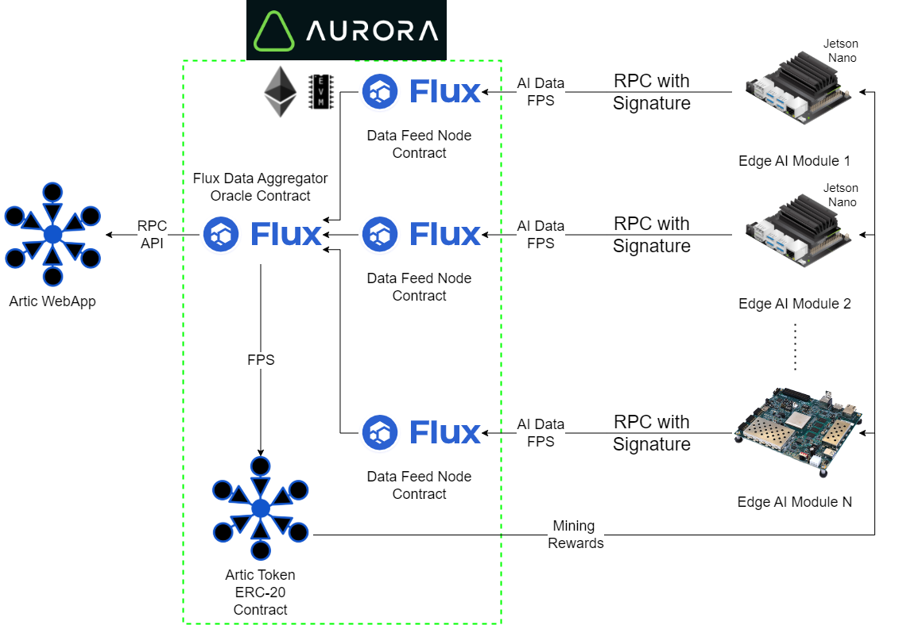
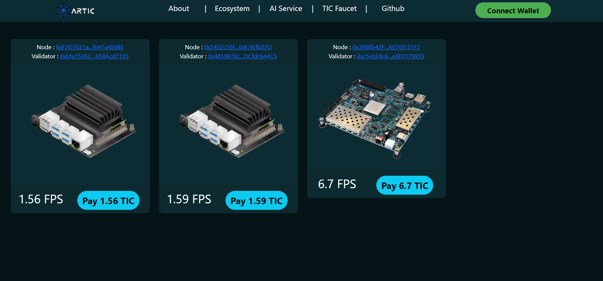

# Artic
 AI and Blockchain platform.
 
 # Introduction and Problem:

 # Solution:

Artic es una plataforma decentralizada de Oraculos basados en el procesamiento de AI en Edge.

 ## System's Architecture:

 # WebApp UI:

 ## Landing:

 Como parte de la solucion tenemos nuestra pagina de inicio, donde explicamos el proyecto puedes revisar toda nuestra documentacion.

 ## AI Service:

En nuestra pagina de AI service podras ver uno de nuestros oraculos alimentando a su contrato en tiempo real, todos esto puedes revisando directamente en el Explorer de Aurora.

En este caso este oraculo obtiene sus datos del procesamiento en edge de imagenes en una jetson nano a travez del modelo YOLOv3, este es un ejemplo practico de como podria ser alimentado el oraculo con un modelo de AI.

## TIC Faucet:

Como parte de nuetro sistema, creamos una ERC-20 token con el fin de poder proveer un incentivo para los mineros que se unan a nuestra plataforma de AI.

Si quieres obtener algunos token de prueba porfavor entra a la pagina de la Facuet y sigue las intruccines ahi mencionadas.

## Payment:

Como parte de las rewards que queremos darle a los mineros por proveer informacion a los oraculos, como proveedores podemos realizar un pago directo de nuestra token desde la pestaña de payment, si quieres probar el mandar algo de TIC a uno de ellos primero revisa la seccion de [Faucet](#tic-faucet)

Los botones de Pay son funcionales, prueba el mandar algo de TIC a alguno de los mineros por su buen trabajo.

Al hacer clic en las direcciones de los mineros puedes ver sus Address y ver las interacciones con los nodos directamente.

 ## What's next for Artic: